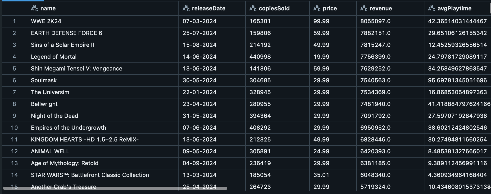
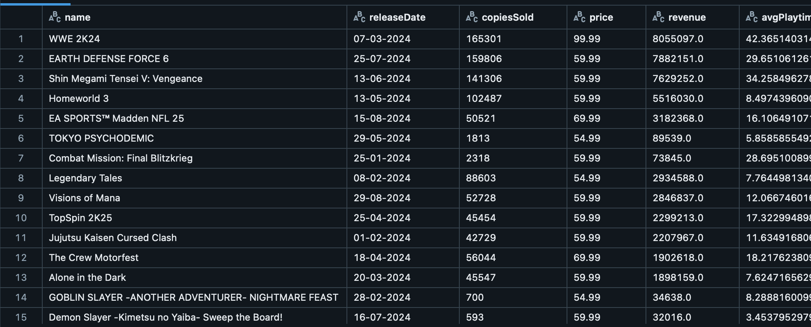

# TengyuHsiao_IDS_Project11

## Overview

This project demonstrates a data pipeline using Databricks that reads data from a csv, processes it, and writes the output back to S3. The pipeline is integrated with GitHub CI/CD using GitHub Actions.

I did a transform and perform a data sink.
## Before the transform:
it contains every rows:

## After the transform:
I filter the rows that have price less than 50 dollars:

